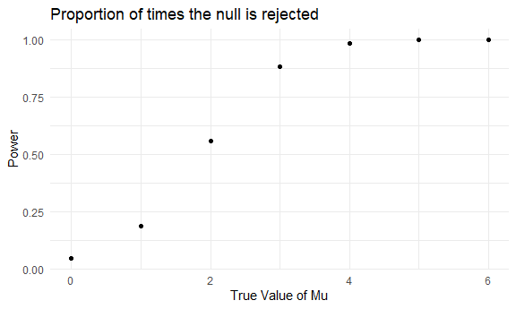
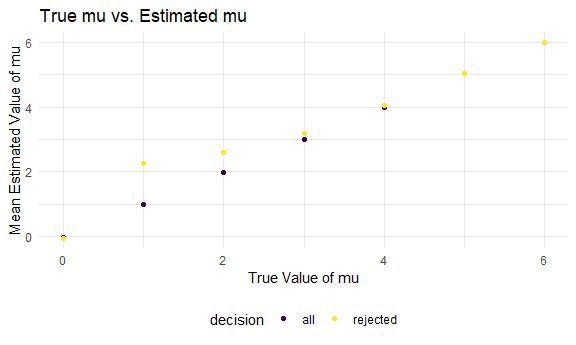

p8105\_hw5\_ly2496
================
Ling Yi
11/10/2020

Problem 1

Raw Data: Dataset is from The Washington Post who gathered data on
homicides in 50 large U.S. cities and made the data available through
GitHub repository. The dataset contains variables such as latitude,
longitude, state, city, victim\_sex, victim\_age, victim\_race, first
name, last name report number, and dispostion. The dataset contains
52178 observations.

``` r
homicide_df = 
  read_csv("homicide_data/homicide-data.csv") %>% 
  mutate(
    city_state = str_c(city, state, sep = "_"),
    resolved = case_when(
      disposition == "Closed without arrest" ~ "unsolved", 
      disposition == "Open/No arrest"        ~ "unsolved", 
      disposition == "Closed by arrest"      ~ "solved",
    )
  ) %>% 
  select(city_state, resolved) %>% 
  filter(city_state != "Tulsa_AL")
```

    ## Parsed with column specification:
    ## cols(
    ##   uid = col_character(),
    ##   reported_date = col_double(),
    ##   victim_last = col_character(),
    ##   victim_first = col_character(),
    ##   victim_race = col_character(),
    ##   victim_age = col_character(),
    ##   victim_sex = col_character(),
    ##   city = col_character(),
    ##   state = col_character(),
    ##   lat = col_double(),
    ##   lon = col_double(),
    ##   disposition = col_character()
    ## )

``` r
aggregate_df = 
  homicide_df %>% 
  group_by(city_state) %>% 
  summarize(
    hom_total = n(),
    hom_unsolved = sum(resolved == "unsolved")
  )
```

    ## `summarise()` ungrouping output (override with `.groups` argument)

Prop test for a single city (Baltimore\_MD)

``` r
prop.test(
  aggregate_df %>% filter(city_state == "Baltimore_MD") %>% pull(hom_unsolved),      
  aggregate_df %>% filter(city_state == "Baltimore_MD") %>% pull(hom_total)) %>%
  broom::tidy()
```

    ## # A tibble: 1 x 8
    ##   estimate statistic  p.value parameter conf.low conf.high method    alternative
    ##      <dbl>     <dbl>    <dbl>     <int>    <dbl>     <dbl> <chr>     <chr>      
    ## 1    0.646      239. 6.46e-54         1    0.628     0.663 1-sample~ two.sided

Iterating into a dataframe

``` r
results_df=
  aggregate_df %>% 
  mutate(
    prop_tests = map2(.x = hom_unsolved, .y = hom_total, ~prop.test(x = .x, n = .y)),
    tidy_tests = map(.x = prop_tests, ~broom::tidy(.x))
  ) %>% 
  select(-prop_tests) %>% 
  unnest(tidy_tests) %>% 
  select(city_state, estimate, conf.low, conf.high)
```

Take a look at the results data frame

``` r
results_df %>% 
  mutate(city_state = fct_reorder(city_state, estimate)) %>% 
  ggplot(aes(x = city_state, y = estimate))+
  geom_point() +
  geom_errorbar(aes(ymin = conf.low, ymax = conf.high))+
  labs(
    title = "Proportion of unsolved Homicides by City"
  )+
  theme(axis.text.x = element_text(angle = 90, vjust = 0.5, hjust = 1))
```


\#\#problem 2

``` r
file_name = list.files(path = "./lda_data", full.names = TRUE)

study_df = 
  file_name %>% 
  set_names() %>% 
  map_dfr(read_csv, .id = "file")
```

    ## Parsed with column specification:
    ## cols(
    ##   week_1 = col_double(),
    ##   week_2 = col_double(),
    ##   week_3 = col_double(),
    ##   week_4 = col_double(),
    ##   week_5 = col_double(),
    ##   week_6 = col_double(),
    ##   week_7 = col_double(),
    ##   week_8 = col_double()
    ## )
    ## Parsed with column specification:
    ## cols(
    ##   week_1 = col_double(),
    ##   week_2 = col_double(),
    ##   week_3 = col_double(),
    ##   week_4 = col_double(),
    ##   week_5 = col_double(),
    ##   week_6 = col_double(),
    ##   week_7 = col_double(),
    ##   week_8 = col_double()
    ## )
    ## Parsed with column specification:
    ## cols(
    ##   week_1 = col_double(),
    ##   week_2 = col_double(),
    ##   week_3 = col_double(),
    ##   week_4 = col_double(),
    ##   week_5 = col_double(),
    ##   week_6 = col_double(),
    ##   week_7 = col_double(),
    ##   week_8 = col_double()
    ## )
    ## Parsed with column specification:
    ## cols(
    ##   week_1 = col_double(),
    ##   week_2 = col_double(),
    ##   week_3 = col_double(),
    ##   week_4 = col_double(),
    ##   week_5 = col_double(),
    ##   week_6 = col_double(),
    ##   week_7 = col_double(),
    ##   week_8 = col_double()
    ## )
    ## Parsed with column specification:
    ## cols(
    ##   week_1 = col_double(),
    ##   week_2 = col_double(),
    ##   week_3 = col_double(),
    ##   week_4 = col_double(),
    ##   week_5 = col_double(),
    ##   week_6 = col_double(),
    ##   week_7 = col_double(),
    ##   week_8 = col_double()
    ## )
    ## Parsed with column specification:
    ## cols(
    ##   week_1 = col_double(),
    ##   week_2 = col_double(),
    ##   week_3 = col_double(),
    ##   week_4 = col_double(),
    ##   week_5 = col_double(),
    ##   week_6 = col_double(),
    ##   week_7 = col_double(),
    ##   week_8 = col_double()
    ## )
    ## Parsed with column specification:
    ## cols(
    ##   week_1 = col_double(),
    ##   week_2 = col_double(),
    ##   week_3 = col_double(),
    ##   week_4 = col_double(),
    ##   week_5 = col_double(),
    ##   week_6 = col_double(),
    ##   week_7 = col_double(),
    ##   week_8 = col_double()
    ## )
    ## Parsed with column specification:
    ## cols(
    ##   week_1 = col_double(),
    ##   week_2 = col_double(),
    ##   week_3 = col_double(),
    ##   week_4 = col_double(),
    ##   week_5 = col_double(),
    ##   week_6 = col_double(),
    ##   week_7 = col_double(),
    ##   week_8 = col_double()
    ## )
    ## Parsed with column specification:
    ## cols(
    ##   week_1 = col_double(),
    ##   week_2 = col_double(),
    ##   week_3 = col_double(),
    ##   week_4 = col_double(),
    ##   week_5 = col_double(),
    ##   week_6 = col_double(),
    ##   week_7 = col_double(),
    ##   week_8 = col_double()
    ## )
    ## Parsed with column specification:
    ## cols(
    ##   week_1 = col_double(),
    ##   week_2 = col_double(),
    ##   week_3 = col_double(),
    ##   week_4 = col_double(),
    ##   week_5 = col_double(),
    ##   week_6 = col_double(),
    ##   week_7 = col_double(),
    ##   week_8 = col_double()
    ## )
    ## Parsed with column specification:
    ## cols(
    ##   week_1 = col_double(),
    ##   week_2 = col_double(),
    ##   week_3 = col_double(),
    ##   week_4 = col_double(),
    ##   week_5 = col_double(),
    ##   week_6 = col_double(),
    ##   week_7 = col_double(),
    ##   week_8 = col_double()
    ## )
    ## Parsed with column specification:
    ## cols(
    ##   week_1 = col_double(),
    ##   week_2 = col_double(),
    ##   week_3 = col_double(),
    ##   week_4 = col_double(),
    ##   week_5 = col_double(),
    ##   week_6 = col_double(),
    ##   week_7 = col_double(),
    ##   week_8 = col_double()
    ## )
    ## Parsed with column specification:
    ## cols(
    ##   week_1 = col_double(),
    ##   week_2 = col_double(),
    ##   week_3 = col_double(),
    ##   week_4 = col_double(),
    ##   week_5 = col_double(),
    ##   week_6 = col_double(),
    ##   week_7 = col_double(),
    ##   week_8 = col_double()
    ## )
    ## Parsed with column specification:
    ## cols(
    ##   week_1 = col_double(),
    ##   week_2 = col_double(),
    ##   week_3 = col_double(),
    ##   week_4 = col_double(),
    ##   week_5 = col_double(),
    ##   week_6 = col_double(),
    ##   week_7 = col_double(),
    ##   week_8 = col_double()
    ## )
    ## Parsed with column specification:
    ## cols(
    ##   week_1 = col_double(),
    ##   week_2 = col_double(),
    ##   week_3 = col_double(),
    ##   week_4 = col_double(),
    ##   week_5 = col_double(),
    ##   week_6 = col_double(),
    ##   week_7 = col_double(),
    ##   week_8 = col_double()
    ## )
    ## Parsed with column specification:
    ## cols(
    ##   week_1 = col_double(),
    ##   week_2 = col_double(),
    ##   week_3 = col_double(),
    ##   week_4 = col_double(),
    ##   week_5 = col_double(),
    ##   week_6 = col_double(),
    ##   week_7 = col_double(),
    ##   week_8 = col_double()
    ## )
    ## Parsed with column specification:
    ## cols(
    ##   week_1 = col_double(),
    ##   week_2 = col_double(),
    ##   week_3 = col_double(),
    ##   week_4 = col_double(),
    ##   week_5 = col_double(),
    ##   week_6 = col_double(),
    ##   week_7 = col_double(),
    ##   week_8 = col_double()
    ## )
    ## Parsed with column specification:
    ## cols(
    ##   week_1 = col_double(),
    ##   week_2 = col_double(),
    ##   week_3 = col_double(),
    ##   week_4 = col_double(),
    ##   week_5 = col_double(),
    ##   week_6 = col_double(),
    ##   week_7 = col_double(),
    ##   week_8 = col_double()
    ## )
    ## Parsed with column specification:
    ## cols(
    ##   week_1 = col_double(),
    ##   week_2 = col_double(),
    ##   week_3 = col_double(),
    ##   week_4 = col_double(),
    ##   week_5 = col_double(),
    ##   week_6 = col_double(),
    ##   week_7 = col_double(),
    ##   week_8 = col_double()
    ## )
    ## Parsed with column specification:
    ## cols(
    ##   week_1 = col_double(),
    ##   week_2 = col_double(),
    ##   week_3 = col_double(),
    ##   week_4 = col_double(),
    ##   week_5 = col_double(),
    ##   week_6 = col_double(),
    ##   week_7 = col_double(),
    ##   week_8 = col_double()
    ## )

``` r
study_tidy_df =
  study_df %>% 
  mutate(
  file = str_replace_all(file, "./lda_data/", ""),
  file = str_replace_all(file, ".csv", "")
  ) %>% 
  separate(file, into = c("group", "id"), sep = "_", remove = FALSE) %>% 
  pivot_longer(
    week_1:week_8,
    names_to = "week",
    names_prefix = "week_", 
    values_to = "obs"
  ) %>% 
  mutate(
    obs = as.numeric(obs)
  )

study_tidy_df %>% 
ggplot(aes(x = week, y = obs, group = file)) + 
  geom_line(aes(color = group)) +
  labs(
    title = "Observations over time for Each Subject",
    x = "Week",
    y = "Observation"
  )           
```


Overtime, the observations in the control arm have parily constant
values while the observations in the exerimental arm seems to be
increasing over time.

\#\#probelm 3

``` r
sim_t.test = function(n = 30, mu, sigma = 5) {
  
  sim_data = 
    tibble(
      x=rnorm(n = n, mean = mu, sd = sigma)
    )
  
  sim_data %>% 
    summarize (
      mean = mean(x),
      sd = sd(x)
    )
  
  sim_data %>% 
    t.test() %>% 
    broom::tidy()
  
}
```

Testing the fucntion

``` r
test_results = 
rerun(10, sim_t.test(mu = 0)) %>% 
  bind_rows()
```

Running simulations and putting into dataframe

``` r
mu_list = 
  list(
    "mu = 0" = 0,
    "mu = 1" = 1,
    "mu = 2" = 2,
    "mu = 3" = 3,
    "mu = 4" = 4,
    "mu = 5" = 5,
    "mu = 6" = 6
    
  )

output = vector("list", length = 7)


for(i in 1:7) {
  output[[i]] = 
    rerun(5000, sim_t.test(mu = mu_list[[i]]))
    
sim_results = bind_rows(output)
}
```

Graphing the results

``` r
sim_results_df = 
  tibble(
    mu = c(0,1,2,3,4,5,6)
  ) %>% 
  mutate(
    output_lists = map(.x = mu, ~ rerun(5000, sim_t.test(mu = .x))),
    estimate_df = map(output_lists, bind_rows)
  ) %>% 
    select(-output_lists) %>% 
    unnest(estimate_df)
```

``` r
sim_results_df %>%
mutate(reject = ifelse(p.value < 0.05, 1, 0)) %>%
filter(reject == 1) %>% 
group_by(mu) %>%
summarize(prop_reject = n()/5000) %>% 
ggplot(aes(x = mu, y = prop_reject)) +
geom_point() +
labs(
title = "Proportion of times the null is rejected",
x = "True Value of Mu",
y = "Power")
```

    ## `summarise()` ungrouping output (override with `.groups` argument)


As the true value of my increases, so does power (proportion of times
the null is rejected). The power maximizes around when the true mean is
between 3 and 4, where the curve flattens out at 1 after 4.

``` r
sim_results_rej = 
  sim_results_df %>%
    mutate(reject = ifelse(p.value < '0.05', 1, 0)) %>%
    filter(reject == 1) %>% 
    group_by(mu) %>%
    summarize(mean_mu = mean(estimate)) %>%
    mutate(decision = "rejected")
```

    ## `summarise()` ungrouping output (override with `.groups` argument)

``` r
sim_results_all = 
  sim_results_df %>% 
    mutate(reject = ifelse(p.value < '0.05', 1, 0)) %>% 
    group_by(mu) %>% 
    summarize(mean_mu = mean(estimate)) %>% 
    mutate(decision = "all")
```

    ## `summarise()` ungrouping output (override with `.groups` argument)

``` r
ggplot(data = sim_results_all, aes(x = mu, y = mean_mu, color = decision)) + 
  geom_point() + 
  geom_point(data = sim_results_rej) +
  labs(
    title = "True mu vs. Estimated mu",
    x = "True Value of mu",
    y = "Mean Estimated Value of mu")
```


We see that as the true value of mu increases after 3, the mean
estimated value of mu for when the null was rejected diverges further
(is smaller) from the true value of mu.
